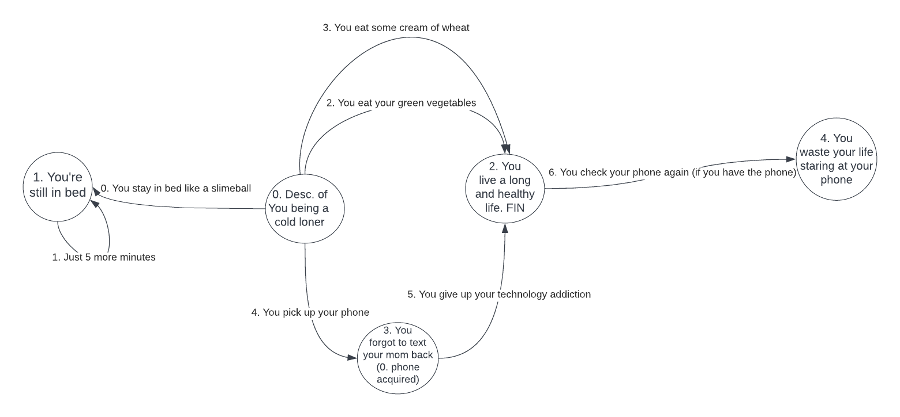

# Jal

## Preface
Jal is a UNCC BINF 6380 Advanced Programming project that challenges students to make a sufficiently complex programming project by the end of the semester. 

## About Jal
Jal is a text-based story adventure that integrates a GUI for increased interactivity and provides a finite amount of options for a user in each zone. The events are designed in a [deterministic finite automaton](https://en.wikipedia.org/wiki/Deterministic_finite_automaton) (DFA) schema, and the game engine was developed in a [model-view-controller](https://en.wikipedia.org/wiki/Model%E2%80%93view%E2%80%93controller) (MVC) pattern.

## Running Jal
To start the game, run the Start file using "java Start" on the command line.

## Developing for Jal
Jal's story flow is not hard-coded. You can create your own game with your own rules following the .slime format:

```
number of items~number of situations~number of choices
item 0 name~item 0 description
item 1 name~item 1 description
item 2 name~item 2 description
...
item n name~item n description
situation 0 text
situation 1 text~image file name
situation 2 text~granted item key
situation 3 text~granted item key~image file name
...
situation n text
preceding situation key~following situation key~choice 0 text
preceding situation key~following situation key~choice 1 text
preceding situation key~following situation key~choice 2 text~required item key
...
preceding situation key~following situation key~choice n text
```

An example file that uses the functionality of Jal can be seen in master.slime
```
1~5~7
Phone:~Lots of fun games and scrolling to be had, sometimes i just want to see how much text can fit into a gigaaaaaaantic scollbar
You wake up in your comfy bed. Thinking lots of thoughts about Guts berserk~me_when_java.jpg
You're still in bed...slimeball.No wonder youre not going to sleep tonight working on that project
You Live a Very long and healthy life! Bravo, somehow global warming was solved and the reins of capitalism were finally dropped, cheers to your very very full life comrade.
OH NO. You forgot to text your mom back! How do you even live with yourself you monster.~0
Somehow you wasted the rest of your life staring at that phone since you found that blue checkmark SO appealing. I bet you have a reddit account
0~1~You stay in bed like a slimeball
1~1~Just 5 more minutes!
0~2~Your eat your green veggies
0~2~You eat some cream of wheat
0~3~You pick up your phone
3~2~You give up your tech addiction
2~4~You check your phone again~0
```

This is the corresponding story map for the master.slime example:



The most important constraint of Jal is that **you are limited to 4 choices per situation**.\
The second most important thing to remember is that **NUMBERING FOR ITEMS, SITUATIONS, AND CHOICES START AT 0**!\
It is very important that when you are formatting your file, you **separate your components with a '~' within a line**. This is used as the separator for the regex finder to split up the line. That also means you shouldn't use any '~' within your text to not set everything on fire.
You have the option to grant the player an item upon reaching a particular Situation, or require the player to possess a particular item to be able to select a choice. Additionally, you do not need to use items in your game at all. If you so choose, you may create a game flow that contains no item acquisition in your situations and no conditional choices. To do this, simply remove any item lines in the file, and remove the number of items at the top of the file. Do not set number of items to 0.

As a reminder:
- Granted item keys and images are optional for a Situation.
- A required item key is optional for a Choice.

## Credits
Developed by Eberardo Raymundo and William Willis.